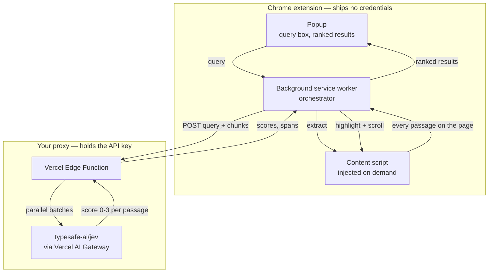

<div align="center">


**Semantic `Ctrl+F` for any web page.**

[](LICENSE)
[](extension/public/manifest.json)
[](https://www.typescriptlang.org/)
[](pnpm-workspace.yaml)
[](proxy/api/search.ts)
[](https://typesafe.ai)

_Ask a question, get the passage that answers it — ranked, scored, and marked on the page._

<!-- Deliberately a bare URL on its own line: that is the only form GitHub renders
     as an inline video player. Wrapping it in a markdown link turns it back into a
     link, and a <video> tag is stripped by GitHub's sanitiser. The source file is
     assets/demo.mp4; the URL above is GitHub's own copy, which is what plays. -->

https://github.com/user-attachments/assets/52f34e86-1001-4a9d-8538-1432ff42c5d6

</div>

Asking **"why are plants green"** on Wikipedia's _Photosynthesis_ article. The word "green"
appears dozens of times on that page, so `Ctrl+F` gives you dozens of places to start reading.
PageLens returns the one sentence that actually answers the question — _"The green part of the
light spectrum is not absorbed but is reflected, which is the reason that most plants have a
green color"_ — scores it, and marks it in place.

The popup ranks passages, labels whether each matched on wording (**Exact**) or on meaning
(**Semantic**), and clicking a result scrolls the page to it.

## Why PageLens?

`Ctrl+F` matches characters. It cannot find "how much does it cost" on a page that says
"billed annually at $90 a seat", because those two things share no words at all.

The usual fix is to send the page to a chat model and hope the prose that comes back is faithful.
PageLens does something narrower and more reliable: it asks
[TypeSafe AI's Jev](https://typesafe.ai/) — a typed decision model that returns **calibrated
scores against a rubric, not generated text** — how relevant each passage is, and ranks by the
number that comes back.

That difference is the whole design:

|                          | Chat model              | PageLens / Jev                                 |
| ------------------------ | ----------------------- | ---------------------------------------------- |
| Returns                  | prose you have to parse | a score from 0 to 3 per passage                |
| Can it invent an answer? | yes                     | no — it only ranks text already on the page    |
| Cost per search          | one large prompt        | one scored question per passage, batched       |
| Shows its work           | you trust the summary   | every result is highlighted where it came from |

Nothing is summarised, so nothing can be fabricated. Every result is a passage that is genuinely
on the page, highlighted where it sits.

## Getting started

```bash
git clone https://github.com/smit153/PageLens.git
cd PageLens
pnpm install
```

PageLens has two halves: a Chrome extension, and a small proxy that holds your API key. The proxy
has to be running before the extension can search anything.

```bash
# terminal 1 — the proxy
cp proxy/.env.local.example proxy/.env.local   # then fill in AI_GATEWAY_API_KEY
pnpm dev:proxy                                  # http://localhost:3000/api/search

# terminal 2 — the extension
pnpm build:extension                            # then load extension/dist at chrome://extensions
```

> **Full walkthrough in [`docs/SETUP.md`](docs/SETUP.md)** — credentials, deploying the proxy,
> loading the extension, and a troubleshooting table keyed by the exact error you see.

### Run modes

| Mode         | Best for     | Proxy runs on          | Command                               |
| ------------ | ------------ | ---------------------- | ------------------------------------- |
| **Local**    | developing   | Node, `localhost:3000` | `pnpm dev:proxy`                      |
| **Deployed** | everyday use | Vercel Edge Function   | `pnpm --filter pagelens-proxy deploy` |

> **A deployed proxy is public and spends real money.** It has no auth and no rate limiting, so
> anyone who finds the URL can spend your AI Gateway credit. Set a spend cap before you deploy
> one, and add a limiter before pointing anyone else at it.

## Architecture



| Piece             | Runs in              | Responsibility                                               |
| ----------------- | -------------------- | ------------------------------------------------------------ |
| Popup             | extension page       | takes the query, renders results and match-kind pills        |
| Background worker | MV3 service worker   | orchestrates everything; the only piece that calls the proxy |
| Content script    | the active tab       | extracts passages, highlights matches, scrolls               |
| Proxy             | Vercel Edge Function | holds the key, batches passages, calls Jev                   |

Two details that are load-bearing rather than incidental:

- **No static `content_scripts` entry.** The content script is injected on demand under
  `activeTab`, so the extension needs no broad host permissions — only your own proxy's origin.
- **The whole page is scored, not a sample.** The proxy splits passages into batches that each fit
  a Jev call and fans them out in parallel.

## Documentation

| Document                                       | What is in it                                                      |
| ---------------------------------------------- | ------------------------------------------------------------------ |
| [`docs/SETUP.md`](docs/SETUP.md)               | Step-by-step setup, from clone to searching, plus troubleshooting  |
| [`docs/ARCHITECTURE.md`](docs/ARCHITECTURE.md) | Message contracts and request/response shapes                      |
| [`docs/DEPLOYMENT.md`](docs/DEPLOYMENT.md)     | Deploying the proxy, env vars, build-error reference               |
| [`CONTRIBUTING.md`](CONTRIBUTING.md)           | Dev setup, commit conventions, pre-PR checklist                    |
| [`CLAUDE.md`](CLAUDE.md)                       | Why the code is shaped this way, and the exact Jev/AI SDK contract |

## Scope and known limitations

- **Single active tab** — no cross-tab or cross-page search.
- **Tables are not extracted yet.** On a reference-heavy page that is a real gap: roughly 45% of
  the text is currently extracted, and a data table can be exactly what a query wants.
- **No caching between page loads** — every search re-extracts and re-scores.
- **Query shape drives the policy.** The relevance floor, result count, and whether the
  sentence-level refine pass runs are keyed to whether you typed one word, a phrase, or a
  question. See `extension/src/query-shape.ts`.
- **No answer means no answer.** A page with nothing relevant says so, rather than listing
  confidently-ranked irrelevant passages.
- **No auth and no rate limiting on the proxy.** Deliberate for v1; add both before exposing a
  deployment to anyone else.

## Tooling

- **pnpm workspace** — `extension/` and `proxy/` as independent packages, no shared build.
- **ESLint (flat config) + Prettier**, via **lint-staged** on a husky pre-commit hook.
- **commitlint** (`@commitlint/config-conventional`) on a husky commit-msg hook.

```bash
pnpm lint         # eslint across the workspace
pnpm format       # prettier --write
pnpm typecheck    # tsc --noEmit in both packages
pnpm build        # builds the extension; the proxy needs no build step
```

## Contributing

Issues and pull requests are welcome. Read [`CONTRIBUTING.md`](CONTRIBUTING.md) first — commit
messages are linted, so a non-conventional message is rejected by the hook rather than by review.

## License

[MIT](LICENSE).
