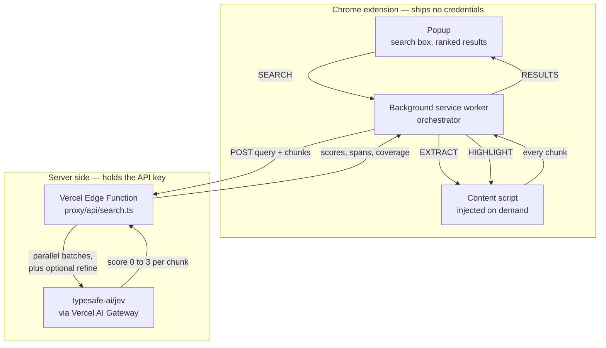
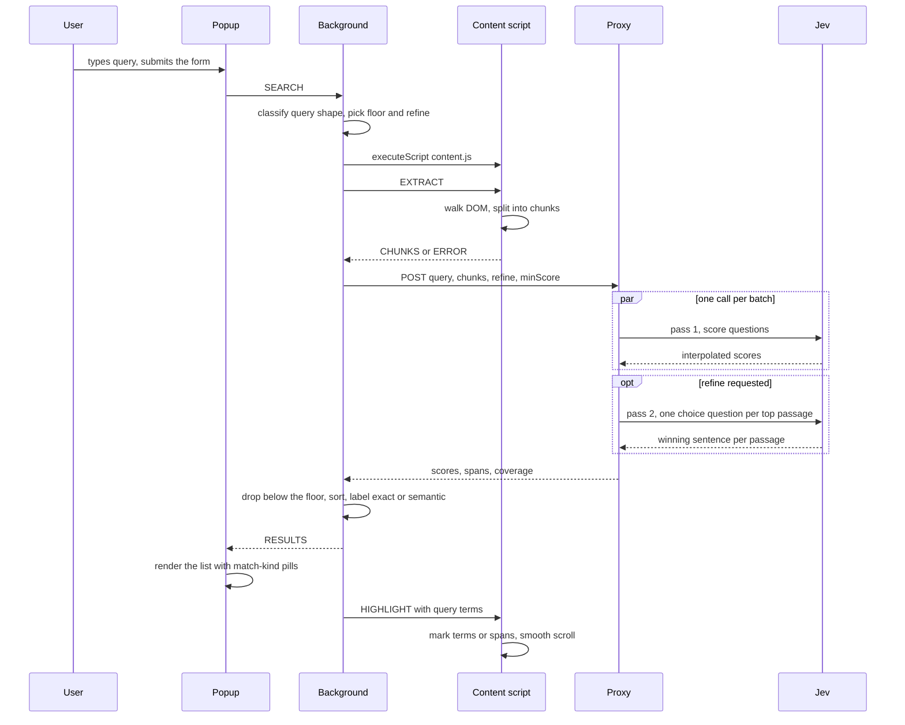
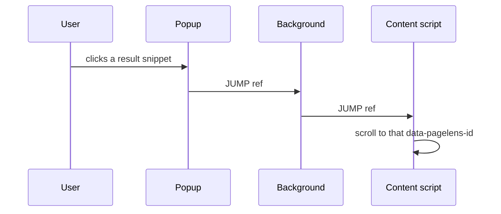
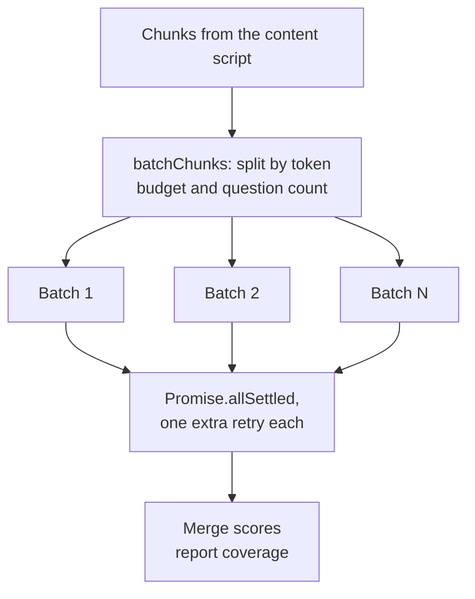
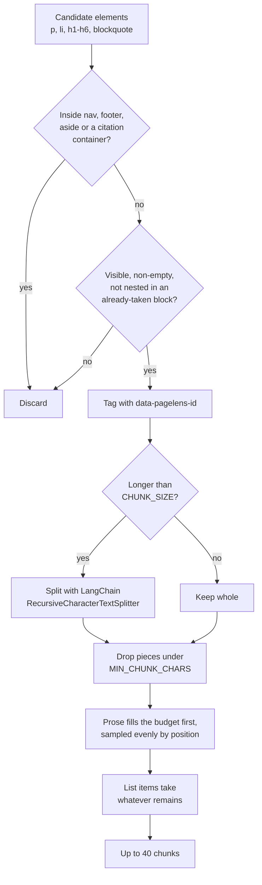
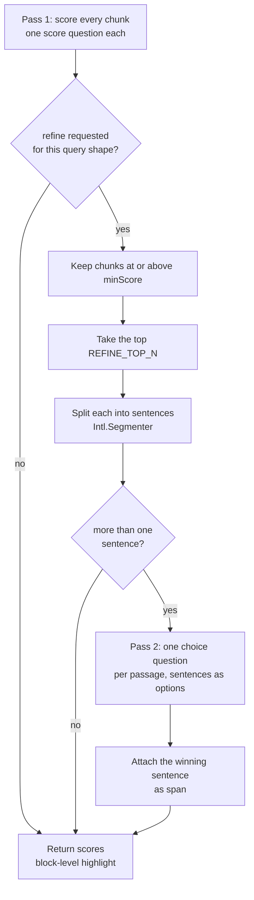

# Architecture

PageLens has three runtime pieces talking over `chrome.runtime` messaging and one HTTP hop to a
proxy. This document covers the message contracts and request/response shapes in detail; see the
root `README.md` for setup and `CLAUDE.md` for the reasoning behind specific design choices.

## Components

| Component         | Where it runs                                | File                                |
| ----------------- | -------------------------------------------- | ----------------------------------- |
| Popup             | Extension page (its own tab-like context)    | `extension/src/popup/`              |
| Background worker | MV3 service worker                           | `extension/src/background/index.ts` |
| Content script    | Injected into the active tab, isolated world | `extension/src/content/`            |
| Proxy             | Vercel Edge Function                         | `proxy/api/search.ts`               |



The extension only ever talks to the proxy, so no Jev or AI Gateway credential ships in the
extension bundle.

## Sequence



Clicking a result in the popup takes a shorter path, since it needs no orchestration:



## Message contracts

All types live in `extension/src/types.ts`.

**Popup -> background** (`BackgroundRequest`):

```ts
{
  type: 'SEARCH';
  query: string;
}
{
  type: 'JUMP';
  ref: string;
}
```

**Background -> popup** (`BackgroundResponse`, sent as the reply to a `SEARCH`):

```ts
{ type: 'RESULTS'; results: RankedResult[] }
{ type: 'ERROR'; error: string }
```

**Background -> content script** (`ContentRequest`):

```ts
{ type: 'EXTRACT' }
{ type: 'HIGHLIGHT'; results: RankedResult[]; terms: string[] }
{ type: 'JUMP'; ref: string }
```

**Content script -> background** (`ContentResponse`, sent as the reply to `EXTRACT`):

```ts
{ type: 'CHUNKS'; chunks: Chunk[] }
{ type: 'ERROR'; reason: 'TOO_MUCH_TEXT' | 'NO_CONTENT' }
```

`Chunk` and `RankedResult`:

```ts
interface Chunk {
  id: string; // e.g. "c3"
  text: string;
  ref: string; // matches a data-pagelens-id attribute on the source element
}

interface RankedResult extends Chunk {
  score: number; // 0..(criteria.length - 1), interpolated
  matchKind: 'exact' | 'semantic';
  span?: string; // the answer sentence, when the refine pass ran
}
```

## Proxy request/response

`POST /api/search` (types in `proxy/lib/types.ts`):

```ts
// request
{
  query: string;
  chunks: Array<{ id: string; text: string }>;
  refine?: boolean;   // run the sentence-level second pass
  minScore?: number;  // don't refine chunks the caller will discard
}

// response
{
  ok: true;
  scores: Array<{ id: string; score: number; span?: string }>;
  coverage: { scored: number; total: number };
}
{
  ok: false;
  error: string;
}
```

Status codes: `400` malformed or empty, `405` non-POST, `500` misconfigured (no
`AI_GATEWAY_API_KEY`), `502` every batch failed.

Each batch is one `evaluate()` call: a shared `state` (`{ query, chunks }`) and one `score`
question per chunk, rubric `not relevant / somewhat relevant / relevant / highly relevant`. See
`proxy/api/search.ts` and `CLAUDE.md`'s "External API reference" section for the underlying
`experimental_evaluate()` contract.

Each question names its own chunk id — `How relevant is the passage with id "c7"...`. That is
load-bearing, not decoration: all the questions share one state containing every chunk, so without
the id nothing distinguishes them and Jev returns near-identical scores across the board.

## Covering the whole page

Every extracted chunk is scored. Chunks used to be capped at 40, which quietly discarded about
three blocks in five and made words that were plainly on the page unfindable — searching `Sweden`
returned nothing because the block holding it was never sent. The proxy now splits whatever it
receives into batches that each fit a Jev call and fans them out concurrently.



Because the batches run in parallel, covering a whole page costs roughly the latency of one call
rather than the sum of them: 260 chunks across 93,696 characters came back fully scored in ~4s.

### The batch limits are measured, not assumed

Jev's documented context is ~32k tokens, but the practical ceiling is well below it, on two
separate axes. Measured against `typesafe-ai/jev`:

| Batch                 | Result                        |
| --------------------- | ----------------------------- |
| 2 questions / ~0.3k   | fine                          |
| 89 questions / ~15.1k | fine, repeatedly              |
| ~118 questions / ~20k | persistent 503s from provider |

So `BATCH_TOKEN_BUDGET` is 12,000 **and** `MAX_QUESTIONS_PER_BATCH` is 80; a batch splits when it
would exceed either. Both are deliberately conservative, because an oversized batch does not
degrade gracefully — it fails outright and takes a slice of the page's coverage with it.

The token model in `proxy/lib/jev.ts` is fitted to the same measurements:

```
tokens ≈ 180 + 79 × chunks + 0.25 × chars
```

The per-question term is paid once per chunk whatever its size, so larger chunks cover more page
per token. The previous estimate of `chars/4 + 40` per question undercounted by ~30%, which is the
dangerous direction: it guarded the "too much text" fallback, so undercounting meant sailing past
the real limit into an API error rather than degrading.

### Partial coverage is reported, never silent

A batch can still fail upstream. The response carries `coverage: { scored, total }`, the dev server
prints it, and the background worker warns when it is short. Returning a confident-looking answer
drawn from 60% of the page without saying so is worse than saying so.

## How the chunk budget is spent

Chunk selection still matters for _ordering_ and for the safety ceiling, even though the page is no
longer sampled down to 40.



Prose wins the budget because reference-heavy pages are dominated by list items. On the Wikipedia
carbon-pricing article, extraction finds 177 blocks of which 120 are `li` — mostly footnotes and
navbox links, which score ~0 against any query.

Sampling stays even _within_ each group so that if a page ever does exceed the safety ceiling, what
survives still spans the whole body rather than just its opening.

### Extraction is the remaining coverage gap

Batching solved _sampling_ coverage. _Extraction_ coverage is a separate, still-open problem: we
pull roughly 45% of the carbon-pricing page's text. Tables alone hold 20,382 characters across 176
cells and are not extracted at all, even though on that page the table of country prices is exactly
what a price-comparison query wants. Citations are skipped deliberately.

## Exact and semantic matches

A result is classified `exact` when the passage literally contains one of the query's meaningful
words, and `semantic` otherwise. The check is a regex in `extension/src/lexical.ts` — no model
call, because whether a passage contains "Sweden" is a string operation.

Word boundaries use letter/digit lookarounds rather than `\b`, which does not fire around
characters like `-` or `$` and so would never match a term like `cap-and-trade`.

The distinction drives both the page and the popup:

| Kind       | On the page                       | In the popup      |
| ---------- | --------------------------------- | ----------------- |
| `exact`    | each literal occurrence, amber    | amber "Exact"     |
| `semantic` | the answer sentence, purple       | purple "Semantic" |
| neither    | soft frame around the whole block | —                 |

Amber for literal hits follows the find-in-page convention; purple is the extension's own colour
for a match Jev made on meaning.

## Marking text in the page

Highlighting wraps matches in `mark` elements rather than using the CSS Custom Highlight API. The
API is tidier — it needs no DOM mutation — but a highlight registered from a content script's
isolated world appeared never to reach the page's renderer, and shipping on an unverified guess was
not worth it.

Wrapping mutates someone else's DOM, so the undo path matters: `clearHighlights` unwraps every mark
and calls `normalize()`, restoring the original text nodes exactly. It also runs before every
re-extraction, so marks never contaminate the next search.

Ranges are wrapped one text node at a time, because `surroundContents` is only guaranteed to work
when a range does not cross element boundaries — and a highlighted sentence very often contains
links or citation superscripts. Wrapping proceeds backwards through the matches in a node, since
each wrap splits the node and would otherwise invalidate the offsets of the ones after it.

All results are marked, not just the first. Previously a passage listed in the popup could sit
unmarked in plain view on screen.

## Query shape drives the policy

Before anything is sent, the background worker classifies the query in
`extension/src/query-shape.ts`. This is deliberately a regex, not a Jev call: whether a string is
one word or a question is _syntax_, and a model round trip to answer it would cost latency and
money for something `split(/\s+/)` settles reliably. Jev's judgement is reserved for meaning.

| Shape      | Example                        | Floor | Results | Refine |
| ---------- | ------------------------------ | ----- | ------- | ------ |
| `keyword`  | `cost`                         | 1.2   | 10      | no     |
| `phrase`   | `the social cost of carbon`    | 1.5   | 8       | yes    |
| `question` | `how much does the plan cost?` | 1.8   | 5       | yes    |

A one-word topic lookup legitimately matches a lot of a page, so it casts a wider net and settles
for a block-level highlight. A full question should have one specific answer, so it demands a
higher score, lists fewer results, and pays for the refine pass.

The floor matters because without one a page with no answer still returned a full list of
confidently-ranked irrelevant passages — the top 8 of a bad set are still the top 8. When
everything is filtered out, the popup says so rather than showing junk.

## The refine pass, or coarse-to-fine

Pass one keeps chunks large so 40 of them still cover a whole page. Pass two then buys precision on
only the handful that earned it. Refining everything instead would force chunks small enough to
wreck coverage: at ~150 characters a piece, a 40-chunk budget reaches about 6,000 characters of a
page instead of 16,000, and the specific questions that most need a precise answer are exactly the
ones whose answer is buried deepest.



Both passes run inside the proxy, so a search is still **one** network round trip from the
extension, with the two Jev calls made server-side next to the gateway.

The `minScore` on the request is the floor the extension is about to apply. Chunks below it get
filtered out client-side anyway, so refining them would spend a Jev call on passages nobody will
ever see. The extension owns the value; the proxy only uses it to avoid wasted work.

Pass two is non-fatal by design: if it throws, the search still returns pass one's ranking and the
UI falls back to highlighting whole blocks. Precision is lost, the search is not.

### Locating a span in the DOM

Finding the sentence to mark is the fiddly part. Chunk text was whitespace-collapsed at extraction
time, so a span never matches the raw DOM text directly. `rangeForText` rebuilds the element's text
in both forms while keeping an index map between them, finds the span in collapsed space, then maps
the hit back to the original text nodes and offsets. If it fails — a page that re-rendered since
extraction, say — the block gets a soft frame instead.

## Why chunk `ref`s are DOM attributes, not selectors

Every extracted block gets `data-pagelens-id="pl-N"` set on it at extraction time
(`extension/src/content/extract.ts`). Scrolling back to a result is just
`querySelector('[data-pagelens-id="pl-N"]')`. When a block is long enough to be split into
multiple chunks (`extension/src/content/chunk.ts`, via LangChain's
`RecursiveCharacterTextSplitter`), every resulting chunk keeps the same `ref` — they all point
back to the one DOM element they came from.
